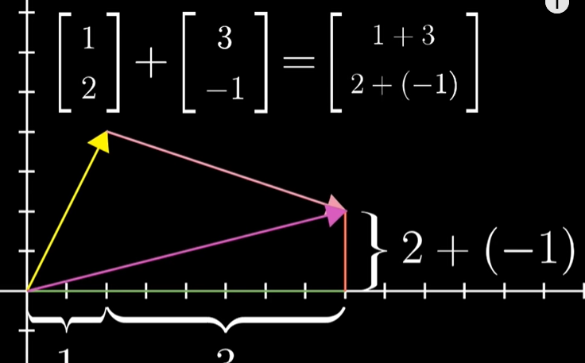
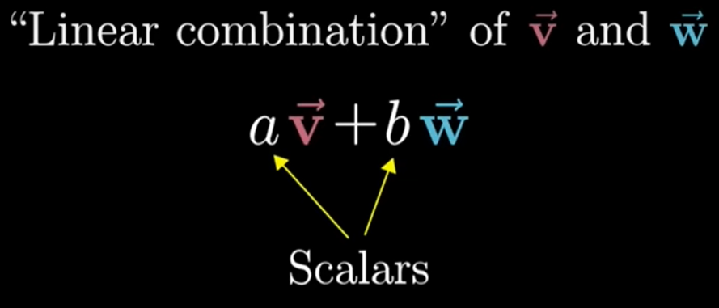

# Vectors

Vector is the fundamental, root-of-it-all building block for linear algebra

## What is vector?

- From a physics student perspective, vector is an arrow pointing in space
- From a CS student perspective, vector is an ordered list of numbers
- From a mathematician's perspective, vector can be anything as long as vector addition and multiplication by a number make sense. For example, vector can be a arrow pointing in space or an ordered list of numbers

## Vector addition

Vector addition use tip-to-tail method, a path from the origin to the tip of the second vector

$$
\left[\begin{matrix}x_1\\y_1\end{matrix}\right] + \left[\begin{matrix}x_2\\y_2\end{matrix}\right] = \left[\begin{matrix}x_{1}+x_{2}\\y_{1}+y_{2}\end{matrix}\right]
$$

## Scalar multiplication (Vector Multiplication by a number)

$$2*\left[\begin{matrix}x_1\\y_1\end{matrix}\right] = \left[\begin{matrix}2x_1\\2y_1\end{matrix}\right]$$

For example, $2\overrightarrow{v}$ means stretch out that vector $\overrightarrow{v}$ by a factor of 2

## Scaling & Scalar

**Scaling (缩放)** means the process of stretching or squishing or reversing the directions of a vector

**Scalar (标量)** is a quantity that is fully described by its magnitude (size or amount) only, and it does not have a direction associated with it such as 2, 1/3, -1.8

> Vector (向量) is fully described by its magnitude and direction