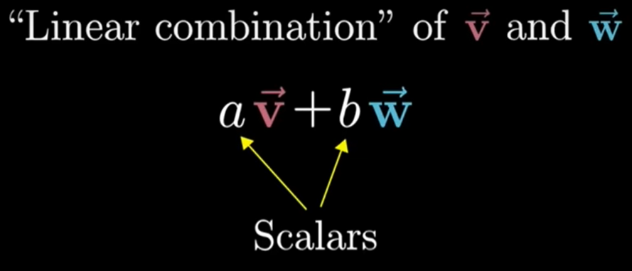

# Linear combinations, span, and basis vectors

- Linear combinations: 线性组合
- Span: 张成
- Basis vectors: 基向量
- Linearly dependent: 线性相关
- Linearly independent: 线性无关

## Basis vectors

**Basis vectors** are fundamental elements in the study of vector spaces in linear algebra:
- $\hat{i}$ (i-hat)
- $\hat{j}$ (j-hat)
- $\left[\begin{matrix}3\\-2\end{matrix}\right] \rightarrow (3)\hat{i} + (-2)\hat{j}$

## Linear combination

**Linear combination** of $\overrightarrow{v}$ and $\overrightarrow{w}$ is:

$$a\overrightarrow{v}+b\overrightarrow{w}$$

## Span

The **"span"** of $\overrightarrow{v}$ and $\overrightarrow{w}$ is the set of all their linear combinations

1. Linearly dependent:
   - Spans a plane
   - $v_1$ and $v_2$ arenot scalar multiples of each other
2. Linearly independent:
   - Spans a line
   - $v_1 = c{v}_2$ for some scalar $c$
3. Zero vector:
   - Spans a line if one vector is non-zero, the origin if both are zero

## Vectos vs. Points

Think of individual vector as arrow:

Think of sets of vectors as points:

## Linearly dependent/independent

Linearly independent: At least one vector in the set can be written as a linear combination of the others.

> In 3-dimensions space, if one vector is a linear combination of two other vectors. Their span is still determined by two other vectors (a plane), independent of this one vector

Linearly independent: Each vector does add another dimension to the span

