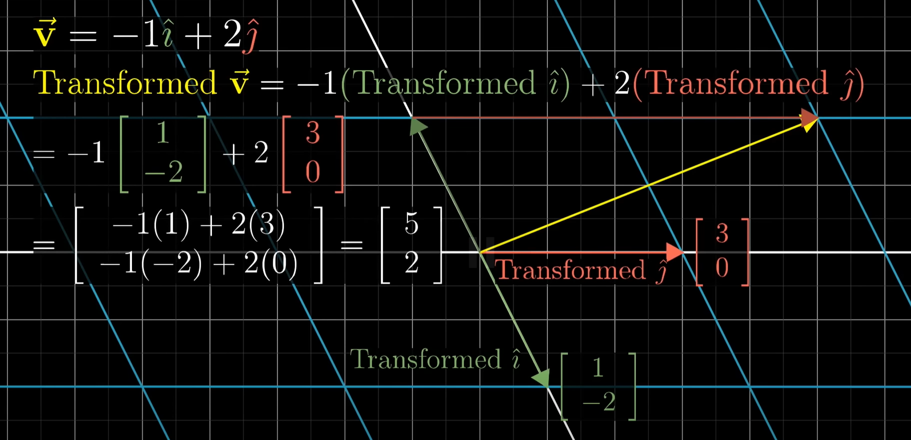
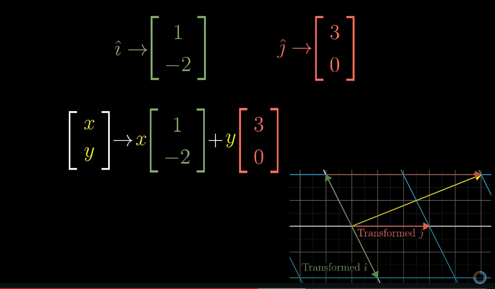
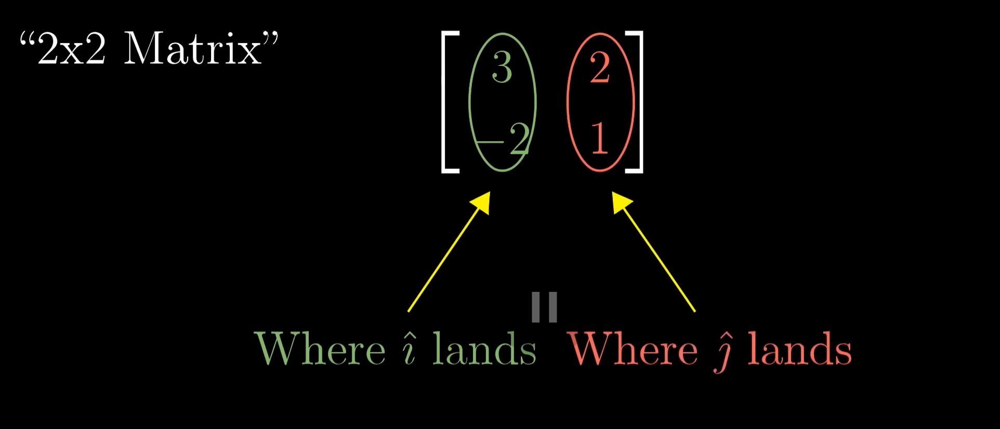
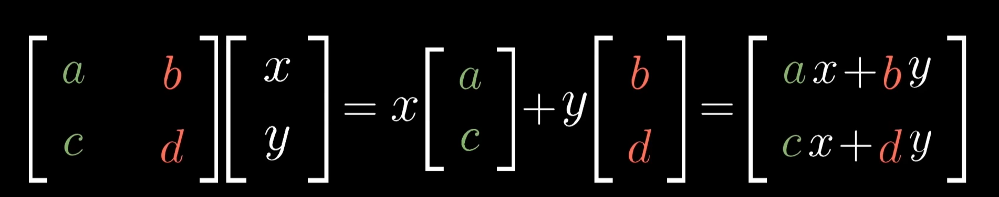

# Linear transformations and matrices

- Linear transformations: 线性变换
- Matrices: 矩阵

## Linear transformations

**Linear transformations** are a way to move around space such that gridlines remain *paralled* and *evenly spaced* and such that the *origin remains fixed*

Beacuse:

$$\left[\begin{matrix}x\\y\end{matrix}\right] \to x*\hat{i}+y*\hat{j}$$

Therefore after linear transformation:

$$\left.\left[\begin{array}{c}x\\y\end{array}\right.\right]\to x\left[\begin{array}{c}1\\-2\end{array}\right]+y\left[\begin{array}{c}3\\0\end{array}\right]=\left[\begin{array}{c}1x+3y\\-2x+0y\end{array}\right]$$

## Matrices associated with linear transformations

==***Matrix can be interpreted as certainly linear transformation of space***==